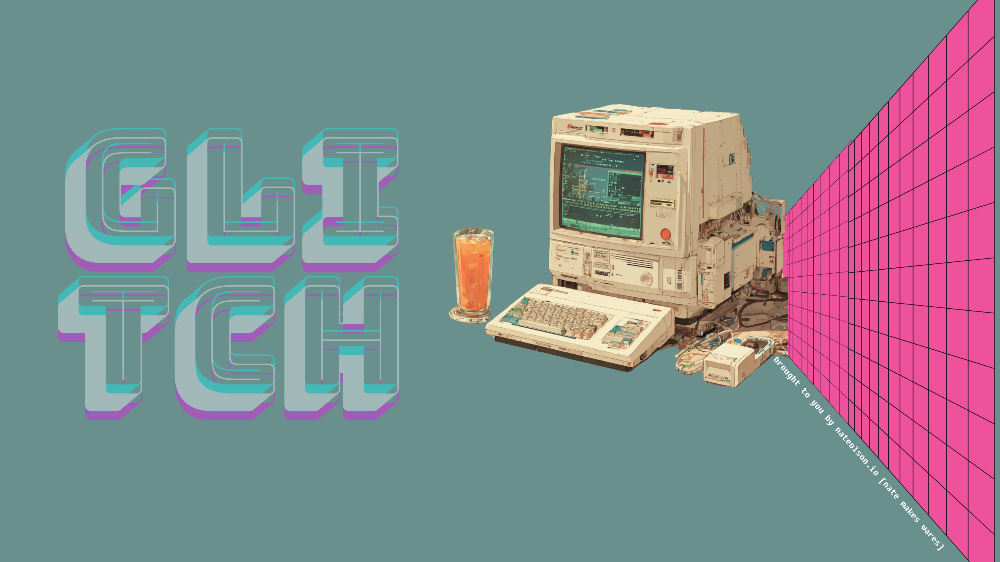

# glitch



Animated vaporwave system info with procedurally jittered ASCII, optional Kitty PNG overlays, and handy entropy tools for encryption workflows. Built to pop open in your shell with almost no footprint, `glitch` is a suckless-inspired fetch that keeps deps to a minimum while still flexing modern crypto tooling.

## Highlights
- This is an awesome terminal fetch application that is rendered with dozens of noise modes (signal, ritual, crown, chill, slashfall, lattice, storm, sunset, palm, gridwave, xmark, hash, dollar, jelly, spiral, diamond, sword, crosshair, etc.) plus optional Kitty image overlay per run, yet it cold-starts in milliseconds and runs happily on minimal resources.
- Configurable stats panel (distro, kernel, uptime, mem, host, user, shell, cpu, ip, disk, ports, entropy) with animated entropy progress bar.
- Automatic palette sampling from your variant PNGs via `scripts/install.sh`, or hand-tuned colors in `~/.config/glitch/color.config`.
- Baked-in vaporwave palettes (`GLITCH_PALETTE=miami|sunset|neon|random`) so you still get neon gradients when Python/image sampling isn't available.
- Variant system: drop square PNGs named after noise modes into `~/.config/glitch/variants` and glitch will pair them; fetcher can auto-seed images from the web.
- Crypto helpers: generate raw entropy, cached entropy, passphrases, and keyfiles for encryption flows directly from the binary.
- Works in full mode (PNG + curl fetcher) or `minimal` text-only build (no network, no Kitty graphics).
- Suckless mindset: tiny C binary, few knobs, zero daemons. You can drop it into a fresh shell, even on constrained boxes, and it will still deliver a flashy fetch plus entropy helpers.

## Install
1) Ensure deps: `cc`, `make`, `libpng`, `zlib`, `curl` (skip curl for `minimal`). Optional: Python 3 + Pillow for palette auto-sampling in `scripts/install.sh`. Note: the Glitch container no longer ships with Python; if you want auto-generated palettes there, install Python 3 + Pillow yourself or set `GLITCH_PALETTE=miami|sunset|neon|random` before running `./scripts/install.sh` to pick a baked-in vaporwave scheme.
2) Build: `make` (or `make lean` for native-optimized, `make minimal` for text-only/offline).
3) Run `./scripts/install.sh` once to scaffold configs, generate `colors.h`/`shape.h`, and seed variants. It also appends this repo to your PATH in `~/.bashrc` (run `source ~/.bashrc` after).
4) Launch: `./glitch` (or `sudo cp glitch /usr/local/bin` if you want it globally).

## Usage
```bash
# main animation
./glitch [--once] [--speed ms] [--duration ms] [--fetch|--fetch-only] [--noise NAME] [--char X] [--image-url URL] [--fast] [--no-net-stats]

# entropy / encryption helpers
./glitch entropy [bytes]        # raw entropy bytes (default 32)
./glitch entropy-cache [bytes]  # reuse ~/.config/glitch/entropy.bin (default 2048, capped 8192)
./glitch gen-pass [len]         # high-entropy passphrase (default 48, min 12, max 96)
./glitch gen-keyfile [bytes]    # keyfile material (default 64, 16-4096 bytes)
```
Flags: `--once` renders a single frame; `--speed ms` controls frame delay; `--duration ms` caps runtime (0 = no cap); `--fetch`/`--fetch-only` refresh variants immediately; `--noise NAME` locks a noise mode; `--char X` sets a custom glyph for the noise fill.

## Configuration
Configs live under `~/.config/glitch/` (auto-created by `scripts/install.sh`):
- `glitch.config`: core options. Keys: `NET_IMAGES` (1/0), `FETCH_SOURCE` (picsum|unsplash|reddit), `FETCH_COUNT`, `FETCH_MAX`, `LOCAL_IMAGES_DIR` (overrides variant dir), `COLOR_CONFIG` (custom palette path), `IMAGE_URL` (download a specific PNG each run), `FAST` (skip network stats/fetches), `NET_STATS` (0/1 to disable/enable DNS/NTP/public IP probes), `STATS` (comma list up to 14 entries from distro,kernel,uptime,mem,host,user,shell,cpu,ip,ip4,ip6,pub4,pub6,dns,ntp,fs,disk,ports,entropy).
- `color.config`: hex colors `BG1..BG4`, `FG_DIS`, `FG_KER`, `FG_UPT`, `FG_MEM`, `FG_PIPE`. `scripts/install.sh` can auto-generate from your PNGs.
- `shape.config`: pick a logo silhouette (gentoo, arch, debian, ubuntu, slackware, lfs, nix, void, etc.).
- `variants/`: square PNGs named after noise modes (e.g., `ritual.png`). Used for Kitty overlays and palette sampling; random variant chosen each run unless locked. If `NET_IMAGES=0` or `LOCAL_IMAGES_DIR` is set, any `*.png` in that directory will be used (even if the filename doesn’t match a noise mode).
- Palette overrides: set `GLITCH_PALETTE=miami|sunset|neon|random` (or `auto` to force image sampling) before `./scripts/install.sh` to select a baked vaporwave palette even without Python or local PNGs.
Palette presets live in `config/color.config.*`; copy one to `~/.config/glitch/color.config` and rerun `./scripts/install.sh` to apply.

Environment knobs: `GLITCH_SPEED`, `GLITCH_DURATION_MS`, `GLITCH_VARIANT`, `GLITCH_NOISE`, `GLITCH_VARIANT_DIR`, `GLITCH_IMAGE_PATH`, `GLITCH_IMAGE_URL`, `GLITCH_FAST`, `GLITCH_NET_STATS`, `GLITCH_CHAR`, `GLITCH_DEBUG`, `COLOR_CONFIG`.

## Entropy & encryption features
- `entropy` subcommand streams cryptographically strong bytes from `/dev/urandom` (falls back to internal RNG if unavailable).
- `entropy-cache` keeps a reusable blob at `~/.config/glitch/entropy.bin` and outputs it; handy for repeatable keyfile/seed workflows without re-hitting the kernel RNG every run.
- `gen-pass` emits a mixed-case, digit, and symbol passphrase drawn from a curated alphabet to avoid ambiguous characters.
- `gen-keyfile` produces raw key material suitable for disk encryption/key derivation; byte length is clamped to 16–4096.
- Main UI shows an entropy progress bar tracking toward 4096 bytes by default; progress is persisted in `~/.config/glitch/entropy.progress` so runs pick up where they left off.
- Capture-and-go entropy: pipe `./glitch entropy 64` straight into `ssh-keygen -A` or stash it as a seed for CTF prng puzzles. The cached mode gives repeatable blobs so you can rerun challenges without pulling fresh bits every time, while still leaning on kernel entropy for safety.
- RNG research friendly: dump bulk entropy to fuzz your own randomness analyzers, build keyfiles for LUKS, or feed `gen-pass` into your password vault; everything is local, inspectable, and designed to complement security lab workflows.

## Variant fetching & palettes
- If `NET_IMAGES=1`, glitch will fetch square PNGs into `~/.config/glitch/variants` (default source: picsum; also supports unsplash/reddit) up to `FETCH_MAX`, refreshing at most every 6h.
- `scripts/install.sh` samples colors from your variants (via Pillow) to build `color.config`; otherwise it writes a pleasant baked-in palette.

## Build modes
- `make` (default): full build with Kitty images and curl-powered fetcher.
- `make lean`: adds native `-march` tuning and strips symbols for a smaller, faster binary.
- `make minimal`: text-only; disables network fetches and Kitty images, links only png/zlib.

## Tips
- Lock a theme: set `GLITCH_VARIANT` (or `GLITCH_NOISE`) to the basename of a PNG in `variants/`.
- Lock the vaporwave shapes: set `GLITCH_NOISE=sunset|palm|gridwave` to force the neon sun/palm/grid templates (and pair matching PNGs if present). For symbols, try `GLITCH_NOISE=xmark|hash|dollar|jelly|spiral|diamond|sword|crosshair`.
- Customize stats: edit `STATS` in `glitch.config` to reorder/show up to 10 entries.
- Palette experiments: drop a PNG into `variants/` and rerun `scripts/install.sh` to regenerate `color.config` from it.

## License
MIT. See `LICENSE`.
